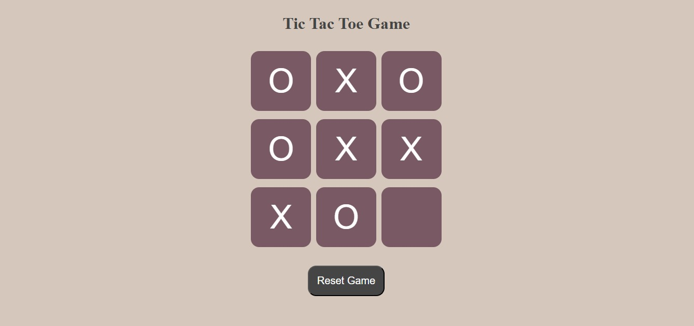
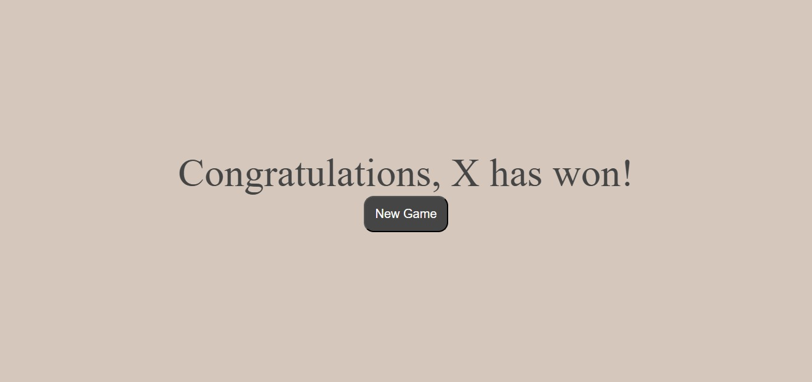
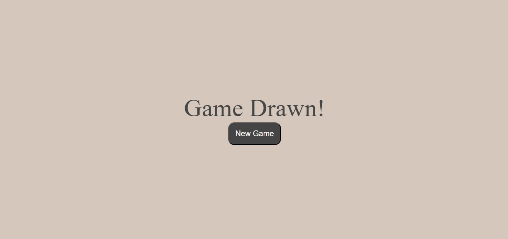

# Tic Tac Toe Game

A simple Tic Tac Toe game built using HTML, CSS, and JavaScript.

## Features

- Two-player gameplay (X and O)
- Turn switching between players
- Winner detection
- Draw detection
- Reset game functionality
- New game option

## Technologies Used

- HTML
- CSS
- JavaScript

## How to Run

1. Clone the repository:

```bash
git clone https://github.com/zaid-bin-kamal/Tic-Tac-Toe.git
```
## Preview






